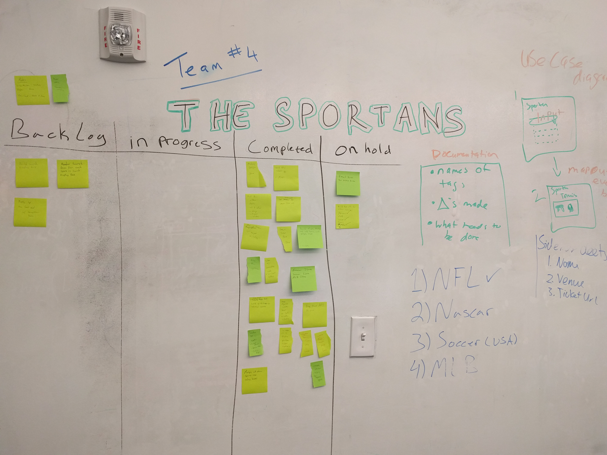
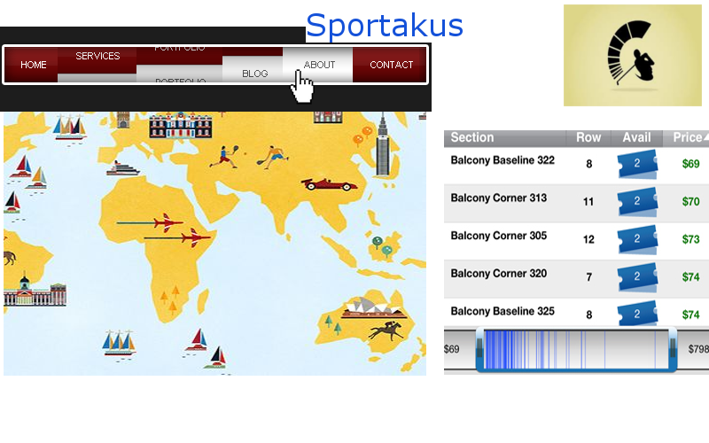
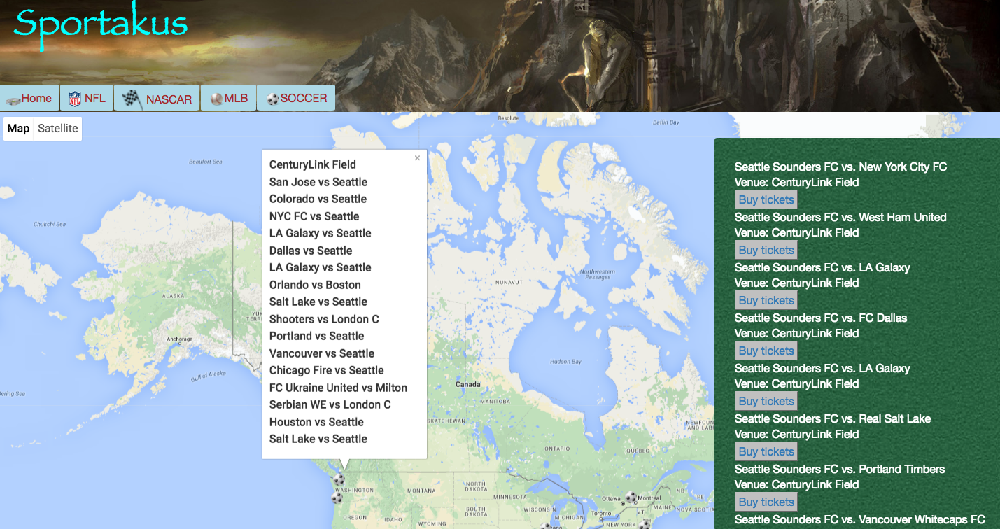
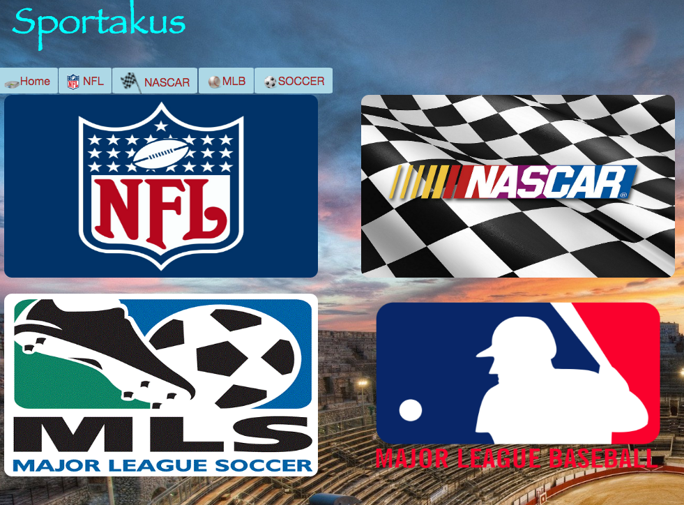
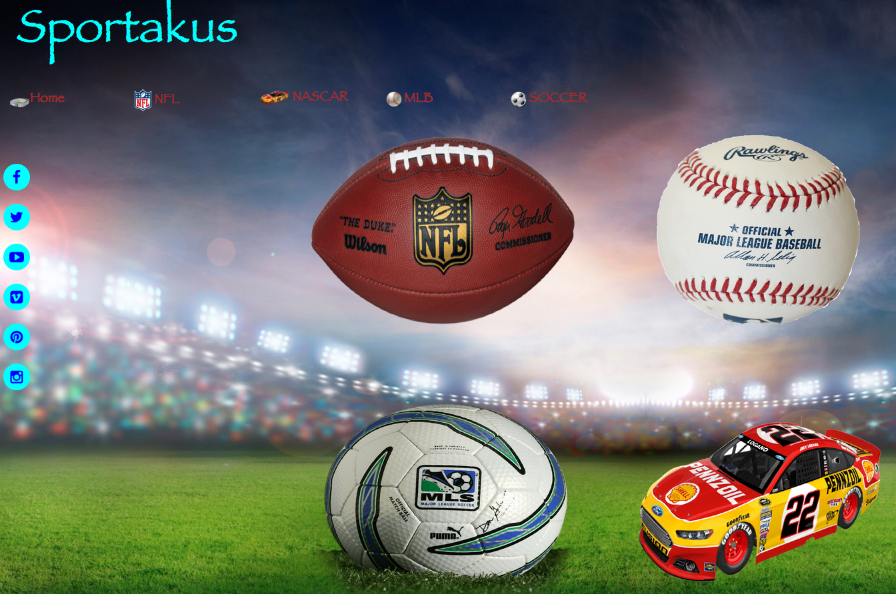

# WHAT IS SPORTAKUS?
Sportakus is a front-end project for DigitalCrafts utilizing everything we've learned so far. We had one week to finish our Sports Matches and Tickets application. Our project will be a sort of sports aggragator that pulls:
* Map of where current matches are held
* Options to buy tickets
* Historical data of past matches

Our learning objectives included:
* Working together as a team, practice effective communications via explicit documentation through Github
* Scrum agile methodology implemented via daily scrum meetings and scrum board to track our progress

# TECHNOLOGIES USED 
Languages
* HTML5
* CSS3 
* JavaScript
* AngularJS

API's
* Sports Radar
* Ticketmaster
* Google Maps

Additional Tools:
* XML to JSON converter: http://www.utilities-online.info/xmltojson/#.V17zT-YrJhE

# TEAM CONTRIBUTIONS
* Matthew: worked on core functionalities of the app (building local JSON files to store data), helped the team with problem-sovling javascript issues.
* Dave: designed the mockup using GIMP, helped with some design aspects (image resizing, image optimizations, etc.), functionality of Soccer page, intense research on Stubhub API (turned out to be bust), then switched over to TicketMaster API, helped consolidate changes together in Github
* Sandyha: came up with the sports idea, designed the html pages, worked on Nascar functionality

# MOCKUP DESIGNS

# PHASES OF OUR PROJECT

# OBSTACLES
Due to the limitations of the API's used, we could only make so few calls to pull information from their databases. So, as a workaround, we downloaded their databases as a JSON file and made calls "locally" anytime we needed ticket information (who's playing, what stadium, location, etc).

# NEXT STEPS
* Dynamic data pulls from assorted API's (this can be accomplished on paid accounts for API services)
* Add more sports to app
* Add login functionality to remember user ticket/sports preferences
* Add news feed carousel at the bottom, can be accomplished using Bing API

